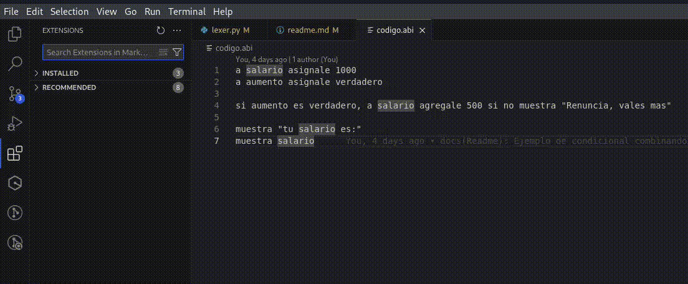

# Abi Lenguaje de Programación

## El lenguaje para que de una vez por todas aprendas a programar

Basado en el lenguaje natural del español mexicano, y listo para que hasta un bebé pueda aprender, tenemos un lenguaje que hace exactamente lo que le estás escribiendo.

## Hola mundo en Abi

```
muestra "Hola mundo"
```

la salida de ejecutar el codigo.abi seria

```
Hola mundo
```
## ¿Por qué programar con Abi?

La diferencia con otros lenguajes en español es que este no "traduce" las palabras reservadas típicas de los lenguajes, sino que estas se integran directo en las frases para sonar de manera lógica tal que se pueda entender lo que hace el lenguaje incluso sin tener que escribir, alguien simplemente te puede contar lo que está leyendo y al final sabes donde y que valores toman las entidades que te están contando.

Es mucho más fácil entender y guardar en la memoria (humana).

```
a mi_edad asignale 20
```
que retener "mi_edad menor menos 20"
```
mi_edad <- 20
```
tambien podrias pensar en "mi_edad flecha izquierda 20"

Pero al final, te quedarías con que mi_edad vale 20 porque sabes que se le ha asignado ese valor, puesto que ya es una frase no tienes que aprender un lenguaje de programación, sino que ya sabes un lenguaje, ESPAÑOL, ahora solo te faltaria saber programar pero en gran parte también ya lo sabes, le das valores a las cosas y también las modificas, entonces una vez que aprendas a hacer operaciones básicas con este lenguaje, estarás listo para dar el salto a cualquier otro lenguaje de programación.

### Comparación de ciclos
Los loops (ciclos) en programación simplemente son repeticiones de algo n cantidad de veces.


<b>Ciclo en otro lenguaje en español</b>
```
Para i <- 1 Hasta 5 Hacer
  Escribir "Hola Mundo"
FinPara
```

<b>Ciclo en Abi</b>
```
repite:  muestra "hola Mundo" 5 veces
```
En el español los dos puntos ":" se usan como ejemplificación del resto del contenido.

Por eso mismo cuando en Abi te encuentras con los dos puntos tu cerebro ya va a saber que lo que sigue es una acción derivada de la palabra que antecede los dos puntos.

Ejemplo: Esta misma linea es un ejemplo de ello.

En Abi
```
comentario: Esto solo lo va a leer el desarrollador, la maquina lo va a ignorar

repite: muestra "hola" 3 veces

ejecuta: unBloqueDeCodigo

```

## ¿Quién y cómo usar el lenguaje?
Si hablas español y estás iniciando en el mundo de la programación, muchas veces usan frases que hacen cosas que pueden ser sentencias de un lenguaje de programación, lo que vas a hacer con Abi Lenguaje de Programación es entrenar e interiorizar las sentencias. De esta forma cuando entres a aprender otro lenguaje cualquiera que este sea se haga muy facil de usar, lo más importante son los conceptos.

## Definición de variables
Imagina que tienes cartones para hacer cajas. Todas las cajas tienen la misma base, pero cada una necesita una tapa especial. La tapa tiene agujeros en forma de números o letras, pero no de ambos. La tapa define el tipo de datos que podrás poner dentro de tu caja. Si la tapa tiene agujeros en forma de números, solo podrás meter números en la caja. Si tiene agujeros en forma de letras, solo podrás meter letras. Así, la tapa determina el tipo de datos que la caja puede contener.

Solo pon atención a los arreglos, esos serian como contenedores, y puedes guardar cualquier cosa.

## Sintaxis

Asegurate de instalar la Extensión oficial de Abi Lenguaje de programación, asi tendras un resaltado en tu editor para hacerte aun mas sencillo leer el código



```
a tu_contenedor asignale 5
```

Sería el equivalente a guardar un número entero 5 dentro un elemento llamado "tu_contenedor" y ahora ese elemento vale 5.

## comentarios
Esto en el código no representa alguna acción, simplemente es para poder hacer tus anotaciones en caso que quieras aclararte algo cuando veas tu código.

Inician con la palabra reservada "comentario:" es importante los dos puntos no solo por sintaxis sino por emular correctamente el lenguaje


```
comentario: esto no lo va a interpretar el compilador, solo es para anotaciones
```

## Declaración de variables

En este lenguaje tienes que definir tu variable con un valor inicial con la palabra "asignale".

### números

```
comentario: inicializar enteros
a mi_edad asignale 0
```

### Booleanos o valores logicos

```
comentario: Inicializar booleanos
a tres_monitores asignale falso
```

## texto

Las cadenas de texto (strings), en la mayoría de lenguajes de programación se representan encerradas en comillas dobles, en el español se usan para  poner frases o citas, muy parecido pero ya que le das ese significado te va a hacer todo el sentido del mundo en los otros lenguajes.

```
a la_puerta asignale "negra"
```

### arreglos

Es un tipo de dato que puede almacenar varios elementos, los cuales los puedes recorrer, imagina que tienes un contenedor con compartimentos vacíos dentro.


```
a la_caja_secreta asignale vacio
comentario: el contenedor ahora  tendria el espacio vacio []
a la_caja_secreta agregale "una cuerda"
a la_caja_secreta agregale "un compartimiento secreto"
a la_caja_secreta agregale "foto de fiesta de navidad"
comentario: como no quieres que se vea lo que hay en la caja secreta quitale algunos elementos
comentario: con la instruccion "quitala algo" se elimina el ultimo elemento
a la_caja_secreta quitale algo
comentario: aun se muestra el compartimiento secreto
a la_caja_secreta quitale algo
comentario: listo, ahora si muestras la caja secreta solo veran la cuerda

muestra la_caja_secreta
```

## actualizar variables

para actualizar el valor es igual como cuando las declaras, de esta forma el valor que tenia si ya la habias declarado, entonces se va a reemplazar el valor

```
a mi_edad asignale 29
a mi_edad asignale 19
a mi_edad asignale 5

muestra mi_edad
```

## incremento y decremento de variables
se hacen con las palabras reservadas "agregale" y "quitale"
```
a monedas asignale 20
a monedas agregale 5
a monedas quitale 3

muestra monedas

comentario: la salida seria 22
```

## ¡También funciona con cdenas de texto!
```
comentario: si Alan tiene dos manzanas 
a manzanas asignale "dos"

comentario: Jesus le da mil
a manzanas agregale "mil"

comentario: Ana le quita dos
a manzanas quitale "dos"

comentario: pero José le dona 300
a manzanas agregale "trescientas"

comentario: y luego Yrvin se come mil
a manzanas quitale "mil"

comentario: ¿cuantas manzanas le quedan a Alan?

muestra "A Alan le quedan: "
muestra manzanas
muestra "manzanas"
```
Resultado en la terminal
```
A Alan le quedan: 
trescientas
manzanas
```
<h1 style="text-align:center; font-size: 500%"> 🤯 </h1>

Ten en cuenta que se quitan y ponen fragmentos de cadenas de texto mas no se convierte a numeros, veamos otro ejemplo:
```
a cancion asignale "un elefante se columpiaba sobre la tela de una araña"

a cancion quitale "araña"
a cancion agregale "señora que vendia telas"

muestra cancion
```
y como salida tendrias "un elefante se columpiaba sobre la tela de una señora que vendia telas"

## condicionales
Se usan como ya sabes usarlas.

si se cumple una condición, procedes a mostrar lo que sucede.

es decir, tendrías que usar la palabra "si", luego un valor verdadero o falso dependiendo tu necesidad, seguido de una coma "," y entonces sigue la acción, veamos algunos ejemplo del uso real en el español:

Si tienes hambre, come.

Si tu teléfono se rompe, haz valida la garantía.

Si sabes escribir, ya sabes programar en Abi.

En código es bastante parecido:


```
a los_pollitos_tienen_hambre asignale verdadero

si los_pollitos_tienen_hambre es verdadero, muestra "los pollitos dicen pio pio pio" si no muestra ""

```
la salida del codigo al ejecutarlo seria
```
los pollitos dicen pio pio pio
```
pero si cambias el valor de los_pollitos_tienen_hambre a falso, entonces simplemente no obtendrias nada en el resultado de ejecutar el programa.

## También funciona combinando las otras funciones que ya sabes usar
```
a salario asignale 1000
a aumento asignale falso

si aumento es verdadero, a salario agregale 500 si no muestra "Renuncia, vales mas"

muestra "tu salario es:"
muestra salario
```

## Palabras reservadas

- comentario:
- agregale
- quitale
- a
- y
- o
- si
- no
- repite
- recorre
- veces
- verdadero
- falso
- vacio

Nota que en español tienes conectores como "a", "en", "de" que muchas veces no notamos, pero son de las cosas más útiles para darle lógica a la oración que estás armando. En este lenguaje, además de funcionar como conectores, también marcan la sintaxis válida de ABI. Tomemos como ejemplo "a mi_variable agregale 5":

El equivalente de "a mi_variable" sería "variable =", lo que entendemos como una asignación. Cuando aprendes un nuevo lenguaje, es común confundirse con el "=", ya que parece una evaluación. Normalmente, se tarda en acostumbrarse a pensar en él como una asignación. Por eso, con la letra "a", tiene más sentido que vamos a hacer algo con la variable que sigue.

## soporte para ciclos

## repite (ciclo for)

```
repite: muestra "Hola" 5 veces
```

como salida tendriamos

```
"hola"
"hola"
"hola"
"hola"
"hola"
```

aunque parece mas facil escribir simplemente

```
muestra "hola" 5 veces
```

la palabra reservada "repite", de nuevo es un gran delimitador que ademas marca una correcta sintaxis, que ademas nos indica lo que hay que hacer con lo que sigue.

### recorre (para arreglos)

```
recorre las_tortillas y muestra la_tortilla
```

En python:

```
for la_tortilla in las_tortillas:
  print(la_tortilla)
```

Observemos que nuestra "función" recorre, no nos define a la_tortilla en la declaración del ciclo, pero podemos acceder a ella en el final de la sentencia debido a una declaración interna del lenguaje que hace más fácil la lectura.

Además los delimitadores del ciclo "recorre" y "y" envuelven al arreglo que vamos a recorrer, luego viene la acción y finalmente la variable anónima (al menos hasta que le pongas nombre)

Internamente el lenguaje crea una variable que no tiene nombre hasta que accedes a ella, en este caso definimos por convención y debido al contexto a "la_tortilla" pero pudimos haber escrito cualquier nombre.

```
recorre: las_tortillas y muestra un_perro
```

como resultado seguiria nostrandonos

```
blancas
azules
```

## funciones sin parametros

las funciones o bloques son fragmentos de codigo que van a encapsular funcionalidades, asi si queremos hacer eso varias veces en lugar de repetir el codigo, mandamos a llamar a la funcion.

Preservando el uso correcto y simple del español, tenemos un forma clara para escribir funciones, éstas se pueden entender como actividades.

```
a lampara asignale "apagada"

comentario: comienza con actividad: <nombre-de-actividad> y cuando quieras terminar de escribir la actividad da enter 2 veces
actividad: presionarInterruptor
si lampara es "encendida", a lampara asignale "apagada" si no a lampara asignale "encendida"
muestra lampara


comentario: aqui se manda a llamar varias veces el interruptor para activar o desactivar la lampara

presionarInterruptor
presionarInterruptor
presionarInterruptor
presionarInterruptor


```

la salida seria seguir teniendo la lampara apagada debido a el numero de veces que has presionado el interruptor.

## funciones con parametros

Este tipo de funciones tienen su nombre y las palabras que siguen serian valores que acepta para poder realizar una operacion

```
a mi_edad asignale 29


bloque: restaTres años
  a mi_edad quitale años
fin


```

## resaltado de sintaxis abi
copia la carpeta abi-lenguaje-de-programacion--facilito- a donde estan instaladas tus extensiones
en linux algo asi:
```
└─$ cp -r abi-lenguaje-de-programacion--facilito- ~/.vscode/extensions

```
luego reinicia vscode
## glosario

- variables: Espacio de memoria para almacenar tipos de datos, enteros, logicos, arreglos etc.
- numeros enteros: son los numeros sean negativos o positivos enteros (-n, -2, -1, 0, 1, 2, n)
- datos logicos: Son datos que representan un valor cierto o falso.
- arreglos: son un tipo de dato que puede almacenar varios tipos de datos separados entre si, pero se pueden  recorrer.
- Sentencias: Son las unidades ejecutable más pequeña de un programa, en otras palabras una línea de código escrita es una sentencia.